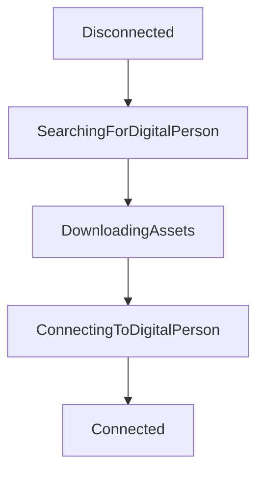

# Connection State

Establishing and maintaining a video connection involves many steps, and unexpected errors may occur at any point during a session. Proper handling of all connection states in your code will ensure you have full visibility of what went wrong and why, which will be essential in providing a positive user experience, and also in debugging any issues.

## Connection Success

A successful call to `connect()` resolves to a `sessionId` string which uniquely identifies the current user's video session.

```ts
session.connect().then((sessionId) => onConnectionSuccess(sessionId));

function onConnectionSuccess(sessionId) {
  console.log('Connected with sessionId:', sessionId);
}
```

There is no requirement to store the `sessionId` in your application for later use, but you may find it useful for tracking and grouping your own events for analytics purposes, or for debugging a particular session with Soul Machines support, who can look up the server logs for a given `sessionId`.

When [Session Persistence](/web-sdk/guides/session-persistence) is enabled, each new video session will re-use the same underlying Digital Person session on the server, and so the `sessionId` will remain the same each time the user reconnects to that same persisted session.

For a simple use case, it is okay to ignore the `sessionId`.

## Connection Failure

A failed call to `connect()` will throw an `error` which includes some details about what went wrong.

A connection can fail for many different reasons, but the `error.name` and `error.message` will provide some guidance for where to start with debugging.

```ts
session
  .connect()
  .then((sessionId) => onConnectionSuccess(sessionId))
  .catch((error) => onConnectionError(error));

function onConnectionError(error: Error) {
  console.log('Connection failed with error:', error);
}
```

A basic implementation of handling the most common errors might look something like this:

```ts
function onConnectionError(error: Error) {
  console.log('Connection failed with error:', error);

  switch (error.name) {
    case 'noUserMedia':
      console.log('user declined device access:', error.message);
      // ask the user to unblock devices
      break;
    case 'noScene':
      console.log('the server is busy:', error.message);
      // ask the user to retry later
      break;
    case 'serverConnectionFailed':
      console.log('server connection failed:', error.message);
      // ask the user to connect from a different network
      break;
    default:
      console.log('unhandled error:', error.name, error.message);
  }
}
```

Possible connection errors:

- **noUserMedia**: the microphone/camera is either not available, not usable or the user declined permission
- **noScene**: no persona was available, the server was busy
- **serverConnectionFailed**: the connection to the server failed
- **notSupported**: the user's browser does not support getUserMedia
- **mediaStreamFailed**: the audio/video stream failed
- **sessionTimeout**: the session timed out before it was fully available
- **controlFailed**: a connection to the orchestration server could not be established
- **noSessionToResume**: an API Key with session persistence enabled was unable to reconnect to the previous session

## Disconnection

If something goes wrong during a session, the scene will disconnect.

```ts
scene.onDisconnectedEvent.addListener((scene, sessionId, reason) => {
  console.log('scene disconnected:', sessionId, reason);
  // handle disconnection
});
```

Possible disconnect reasons:

- **sessionTimeout**: the user did not interact for the length of time defined in the project's session timeout
- **conversationEnded**: the conversation or NLP provider has requested for the session to be ended
- **controlDisconnected**: The orchestration server has disconnected and is no longer able to direct the conversation
- **normal**: the connection was closed

## Connection Progress

The connection speed to the Digital Person (DP) varies due to time, location, and internet speed, which makes visibility into the state of the loading process important for user experience. To display the connection progress, Connection state events are available for use (e.g. to customise the loading interface before the connection succeeds). To this end, infrastructure has been put together that classifies the connection as being in one of the following `ConnectionStateTypes`:

- `Disconnected`
- `SearchingForDigitalPerson`
- `DownloadingAssets`
- `ConnectingToDigitalPerson`
- `Connected`

When `scene.connect()` is called, the connection process has started. It will go through following steps.

1. `SearchingForDigitalPerson` - open websocket connection to DP server, searching for an available DP, may require queuing
2. `DownloadingAssets` - DP is found, starting downloading assets
3. `ConnectingToDigitalPerson` - DP is starting, forming webrtc connection
4. `Connected` - DP is ready, webrtc session has connected



### Subscribing to Connection State/Progress

After creating the `Scene`, you can add callback function to handle connection state before calling the `connect()` method of `Scene` to get the connection progress updates.

```javascript
scene = new Scene({...});

scene.connectionState.onConnectionStateUpdated.addListener(
  (connectionStateData: ConnectionStateData) => {
    // display connectionState updates to the user
  }
);

scene.connect();
```

The callback will receive the current `connectionStateData`. If you are using TypeScript you can import the type `ConnectionStateData` from the Web SDK.

Example of the data you will receive in the callback as below. You can use the suggested `percentageLoaded` value to update a progress bar, or use `currentStep` value to indicate the progress.

```
    name: Disconnected
    currentStep: 0
    totalSteps: 5
    percentageLoaded: 0

    name: SearchingForDigitalPerson
    currentStep: 1
    totalSteps: 5
    percentageLoaded: 25

    name: DownloadingAssets
    currentStep: 2
    totalSteps: 5
    percentageLoaded: 50

    name: ConnectingToDigitalPerson
    currentStep: 3
    totalSteps: 5
    percentageLoaded: 75

    name: Connected
    currentStep: 4
    totalSteps: 5
    percentageLoaded: 100
```

Progress states are an estimate. They should be used for the display of connection progress only, and should not be relied upon for identifying the overall Session connection state.
